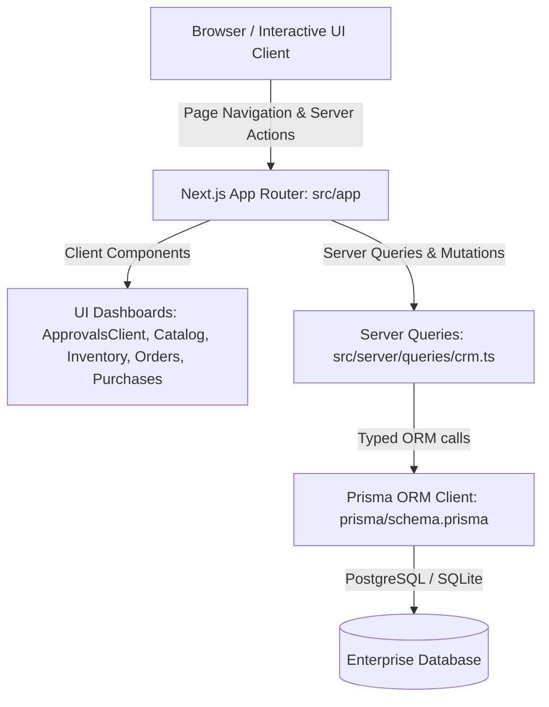

# BluePlanet CRM System Specification (`spec.md`)

## 1. System Overview
BluePlanet CRM is an enterprise-grade full-stack customer relationship and inventory management system built with Next.js App Router, TypeScript, Tailwind CSS / Vanilla tokens, and Prisma ORM backed by PostgreSQL / SQLite.

## 2. Full-Stack Architectural Layers

## 3. Core Component & UI Specifications
### Dashboard Modules
- **`CatalogDashboardClient.tsx`**: Displays enterprise product catalogs, pricing tiers, and inventory stock levels. Enforces structured card geometry (`rounded-xl border border-gray-200/dark:border-gray-800`).
- **`InventoryTableClient.tsx`**: High-density interactive data grid supporting multi-column sorting, filtering, and stock adjustment actions.
- **`OrdersDashboardClient.tsx` & `PurchasesDashboardClient.tsx`**: Order lifecycle tracking with status badges (`Pending`, `Approved`, `Fulfilled`, `Cancelled`).
- **`CommandPalette.tsx` & `Sidebar.tsx`**: Global keyboard-accessible (`Cmd/Ctrl+K`) navigation and workspace switching.

## 4. API & Data Query Contracts (`crm.ts`)
All queries in `src/server/queries/crm.ts` must return typed interfaces matching Prisma generated models (`Customer`, `Order`, `InventoryItem`, `ApprovalRequest`). No raw queries with unsanitized string concatenation are permitted.
